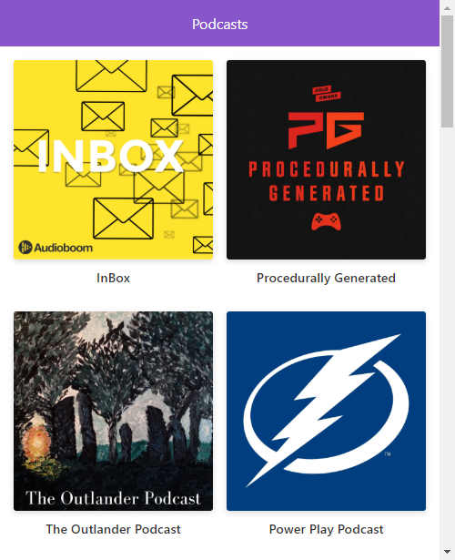

# App de Podcasts de Platzi

App de Podcasts integrada con la API de AudioBoom para aprender Next.JS

[Ver la aplicacion](https://podcasts-tau.vercel.app/)

## ¿Cómo funciona?

Requiere Node.JS 10

* `npm install` para instalar las dependencias.
* `npm run dev` para el entorno de desarrollo.
* `npm run build && npm start` para el entorno de producción.

## Licencia

MIT